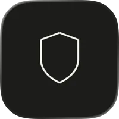

    
    <h1> <b>Rotblock</b></h1>
    

### **Rotblock**

**Rotblock** helps you build healthier digital habits by letting you set real, meaningful limits on the apps and activities that pull you off track. No accounts. No paywalls. No subscriptions. No data ever leaves your device.

### **Built on Apple's Screen Time Framework**

Rotblock is built entirely on Apple's native Screen Time APIs — Family Controls, Device Activity, and Managed Settings — so shields are enforced at the system level. There are no workarounds, and no way for distracting apps to slip through.

### **Privacy first and open source**

Rotblock requires no account, no sign-in, and no internet connection. Every preset, schedule, and usage record stays entirely on your device. What you do with your time is your business.

### **Perfect for:**

- Professionals who need deep focus blocks during the workday

- Students managing study sessions and avoiding distractions

- Anyone trying to reduce mindless scrolling and reclaim their attention

- People who want location-aware limits like staying off social media at work

- Those who've tried willpower alone and wants more friction

- Rotblock uses Apple's Screen Time framework and requires Family Controls authorization on your device. Screen Time parental restrictions must not be managed by another device to use Rotblock.

### **Note**:

- This project was created for my own personal use, and due to time I am not attentive to it.
- If you'd like to give feedback or want to reach out, feel free to write [via email](mailto:nick@n-n.dev)
